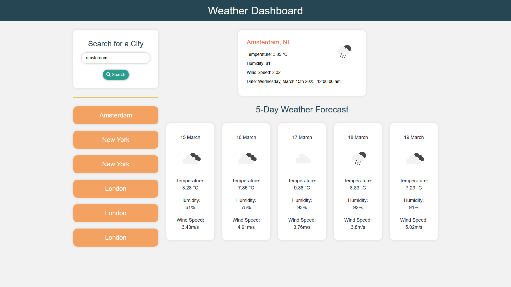

# weather-dashboard
A weather dashboard that will run in the browser and feature dynamically updated HTML and CSS

# Module 8 Server-Side APIs: Weather Dashboard

## User Story

AS A traveler
I WANT to see the weather outlook for multiple cities
SO THAT I can plan a trip accordingly

## Acceptance Criteria

* Create a weather dashboard with form inputs.
  * When a user searches for a city they are presented with current and future conditions for that city and that city is added to the search history
  * When a user views the current weather conditions for that city they are presented with:
    * The city name
    * The date
    * An icon representation of weather conditions
    * The temperature
    * The humidity
    * The wind speed
  * When a user view future weather conditions for that city they are presented with a 5-day forecast that displays:
    * The date
    * An icon representation of weather conditions
    * The temperature
    * The humidity
  * When a user click on a city in the search history they are again presented with current and future conditions for that city

## Method

1. Mark up HTML and create CSS and Javascript files
2. Add Ajax functionality to JS file to fetch data from the API
3. Add lat and lon to API url and use this to get the city
4. Use this to fetch weather data
5. Use Moment to get date and time
6. Display this data
7. Add cities to local storage
8. For forecast, use lat/long api url created to loop through response data
9. Add cards to HTML
10. Add data to cards
11. Search history event click
12. Search history function to see if it is in local storage, fetch and display list

## Screenshot of deployed app

## URL of deployed app

https://maclauren.github.io/weather-dashboard/ 